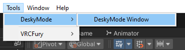
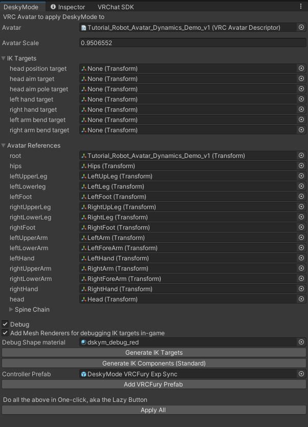

# DeskyMode

VTube in VRChat: 
Unity tool to generate components for head-source, IK-driven avatar motion in desktop VRChat 

https://github.com/user-attachments/assets/42acdfec-d794-4d9c-a9b7-66f06b7ae274

Stream Usage Example

 

https://github.com/user-attachments/assets/848ec761-f197-428c-b576-34f5eea21680

Uses proposed head tracking parameters in VRCFaceTracking [(Head Parameters PR)](https://github.com/benaclejames/VRCFaceTracking/pull/248)

## Setup Instructions

0. Make sure your VRC Avatar Project is up to date 
1. Add [VRCFury](https://vrcfury.com/download) to your project
2. Add [VRLabs' Final-IK-Stub](https://github.com/VRLabs/Final-IK-Stub) to your project
   - Alternatively, you can use the actual [Final IK](https://assetstore.unity.com/packages/tools/animation/final-ik-14290) from RootMotion ($$$). This will require a (simple) modifcation[^1] to a DeskyMode script. **YOU DO NOT NEED FINAL IK TO USE DESKYMODE**. The stub works perfectly fine for VRC. 
3. Add DeskyMode to your project
   - Download the latest `.unitypackage` from the Releases tab and import it into your project
   - Download the Package zip, unzip it, and add the package via [Unity Editor's Package manager](https://docs.unity3d.com/2022.3/Documentation/Manual/upm-ui-local.html)
   
[^1]: Open up the `DeskyModeSetup.cs` file and add `#define ActualFinalIK` as the first line. This should be auto-magically done by the package 

## Updating Instructions

1. Import the updated package, or unzip the package zip contents over the original install, or pull this GitHub repo
2. In your Unity Editor top toolbar: `Tools -> DeskyMode -> Refresh Scripts`

## DeskyMode Instructions

DeskyMode can be added to any *humanoid* avatar that has been set up for VRChat. 

0. Make sure your *humanoid* avatar is properly set up for VRChat (with a VRCAvatarDescriptor)
1. Open the DeskyMode tool menu in the top toolbar (`Tools -> DeskyMode -> DeskyMode Window`)

2. Drag your avatar into the Avatar slot 
   - (Optional) Avatar Scale is set automatically based on your avatar's height. You should only set this manually *if the motion of the targets seem too small/large for your avatar*. Generally, you should **not** need to modify this value!
   - (Optional) Check the "Debug" checkbox to see the transforms DeskyMode uses in generating the FIK components (Avatar References and IK Targets)
   - (Optional) Check the "Add Mesh Renderers" checkbox if you would like mesh primitive debug visualizers on the IK targets
   - The default VRCFury prefab uses the synced parameters asset. Note that it will occupy 56 bits of synced avatar parameters space. You can drop in the other prefab (without the "Sync" suffix) that takes *no* synced parameters, but remote users will not see DeskyMode movement if you enter poses via stations or avatar animations or do anything that disables avatar IK Sync. 

3. Click the "Apply All" button to apply DeskyMode to your avatar

## TODO

 - [ ] Massive code refactor because it's a mess
 - [x] ~~Workaround the import compilation issue~~ Find another hack for Package distribution
 - [ ] Better window UI 
 - [ ] Add settings for control of certain FIK properties
    - [ ] Spine stiffness
    - [ ] Different "presets" 
    - [ ] ...
 - [ ] VCC package? 

## Notes

By overriding VRC IK, you lose on avatar IK Sync, thus causing weird remote-only issues with things like Gogoloco (and no synced movement to remote users who don't have your animations shown). 
Overriding VRC IK is useful to keep your head origin aligned with your mouse cursor (when *standing* only, as this does not apply when crouching/prone).
DeskyMode now has checks in the default animator to disable the VRC IK Override if in any state that isn't "standing", including Gogoloco poses. 

There will be some "adjustment" movement if you enable/disable DeskyMode as the head/body snaps to DeskyMode animated/regular position. This also happens if deskymode enable is cycled due to Auto Toggle (i.e. crouching). 
Part of the delay between the toggle and adjustment is due to what seems like some fixed time used by the Tracking Control state behavior, and another part is the recommended transition time. 

Entering GogoLoco poses with "Hand Lock" toggle enabled may sometimes cause the hands to lock in odd positions for remote users. This is because GogoLoco poses are updated by IK Sync, not animation for remote users. 
Thus, the timing of the pose update for remote users is not always consistent. 
  
## License

**All of the source assets and all generated assets from DeskyMode fall under the [MIT License](https://github.com/kusomaigo/DeskyMode/blob/main/LICENSE)**.

## Credits

- [Titatitanium](https://www.twitch.tv/titatitanium) for streaming with early versions and being DeskyMode's #1 sales-gote
- Azmidi's [OSCmooth](https://github.com/regzo2/OSCmooth)
- [VRCFT Discord](https://discord.gg/vrcft) for constantly asking for desktop headtracking to be added to VRCFT

- Video credit (Avatar): [Neri by Graelyth](https://graelyth.gumroad.com/l/rqenf)
- Video credit (World): [Deep Blue by Fins](https://vrchat.com/home/world/wrld_f7a383bc-c925-4696-85c2-2996c0a40112/info)
- Video credit (Pose Animations): [GoGo Loco by Franada](https://www.gogoloco.net/)
